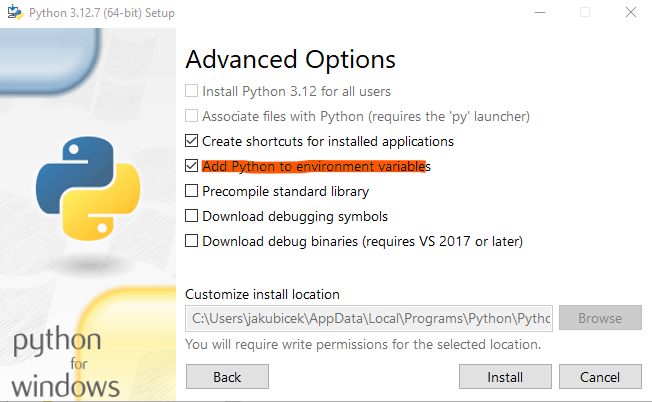

# Pulmonary perfusion changes quantification
This work aimed to develop an automated method for quantifying the distribution and severity of perfusion changes on CT pulmonary angiography (CPTA) in patients with chronic thromboembolic pulmonary hypertension (CTEPH)

## Description
Fully automated quantification of the extent of pulmonary perfusion changes and their distribution on CT pulmonary angiography in patients with chronic thromboembolic pulmonary hypertension by Bayesian analysis.

General information about this tool:

* It works for folder containing dicom files
* The algorithm has three basic steps
  * resaving dicom files to nifti format using dcm2niix [1]
  * lung segmentation using TotalSegmentator [2]
  * automated quantification of lung mosaic:
    * intensity analysis
    * heterogeneity analysis
    * centralization analysis
* output is an excel file with characterization values for each patient folder

## Requirements
* virtual environment
* installed Git
* installed python (tested on 3.12.7)
* installed pip and venv

## Virtual environment

* clone git repository from github
```
git clone https://github.com/JakubicekRoman/lung_CTPA.git
```
* or donwload whole folder from GitHub

Install python 3.12.7 (if not already):
download [**here**](https://www.python.org/downloads/windows/)
* add the python path to Windows Enviroment Variables (or later) during installation

<p align="center">
  
  
</p>

Install Git (if not already):
[**here**](https://git-scm.com/downloads/win)

--------------------------------------------------------------------

You can use the .bat file for easy instalation and setting of virtual enviroment.

Or you can manually install in command window:

Check if the python and pip are installed:
```
py -0
py -3.12 -m python pip --version
```

Create virtual environment (or via anaconda), example for pip and venv:
```
python -m venv ".\.venv"
```

Activate venv
```
.\.venv\Scripts\activate
```

Install the required packages from .txt file:
```
python -m pip install -r requirements.txt
```

## Data directory structure
All data needs to be **dicom** files and one patient (case) needs to be in an single folder 
Example of directory structure of two patient data:
```
... PATH_DICOM_DATA\

+---S44670 
|   +---S40
|   |       DIRFILE
|   |       I10
|   |       I100
|   |       I100
|   |       ...
+---S44660
|      DIRFILE
|      I10
|      I100
|      ...
...
```

## Calling of the program:
call in a command window with the virtual environment activated:

Arguments: 
* -i (--input) input path to dicom files
* -o (--output) output path to save results (optional, creates a "Results" folder in the data path).

```
python LungAnalysis.py --help
python LungAnalysis.py --input folder_with_dicoms --output folder_for_saving
```

Example of calling:
```
python LungAnalysis.py --input .\data\dicoms --output .\data\results
python LungAnalysis.py --input .\data\dicoms
```

## Licence
The tool is possible to use for academic and reseach purposes (MIT License). The proposed approach was submitted to ... 
Please cite the following paper when using tool:
---- It will be added!

## References
[1] Chris Rorden. "dcm2niix: Next-generation DICOM to NIfTI conversion." (2022). 
Available from: https://github.com/rordenlab/dcm2niix

[2] Wasserthal, Jakob et al. “TotalSegmentator: Robust Segmentation of 104 Anatomic Structures in CT Images.” Radiology. Artificial intelligence vol. 5,5 e230024. 5 Jul. 2023, doi:10.1148/ryai.230024
GitHub: https://github.com/wasserth/TotalSegmentator
